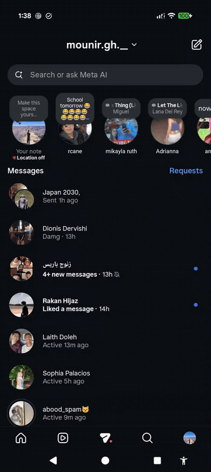
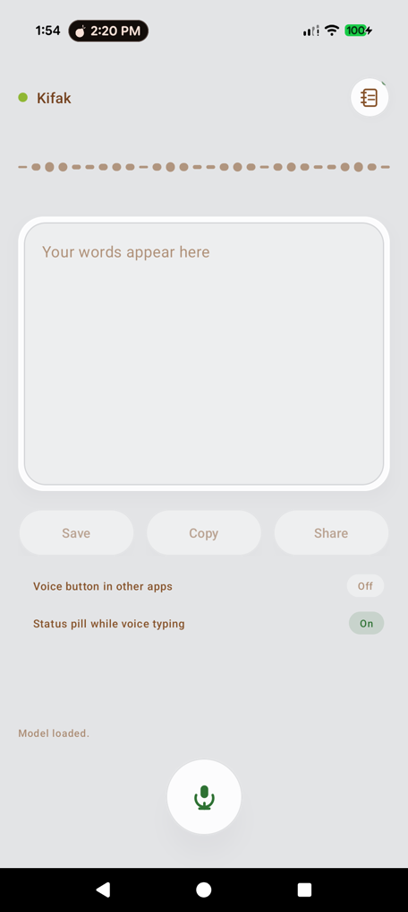

# Kifak — كيفك · Levantine Voice Transcriber

An on-device speech-to-text app for **Lebanese / Levantine Arabic** that speaks
**Arabizi** back — Latin-letter dialect like `hi bro kifak`, `ktir mni7`,
`ja2a al telmizo 2la al gorfa`.

- 100% on-device (whisper.cpp) — no cloud, no account, works offline after setup
- Lebanese dialect dictionary (170+ entries) + letter-mapping fallback
- Silence gating: no hallucinated text when nobody speaks
- Notes with copy/share, all saved locally
- Light neomorphic UI, dark-ink brown on card white

Built on [whisper.cpp](https://github.com/ggerganov/whisper.cpp) and its
[Android example](https://github.com/ggerganov/whisper.cpp/tree/master/examples/whisper.android).
The model is a community fine-tune of Whisper-Small on Levantine dialect
(based on [Laith05/whisper-levantine](https://huggingface.co/Laith05/whisper-levantine)).

## Demo



*A 10-second demo: tap the floating accessibility button in any chat, speak
Lebanese Arabic, tap again — the Arabizi transcription is pasted at the
cursor. 100% on-device, no internet used at inference time.*

## Screenshot



## Model download (first launch)

The APK is tiny (~35 MB) because the model is **not** bundled. On first launch
the app downloads **`ggml-small-levantine-q5_1.bin`** (~190 MB, q5_1 quantized)
from Hugging Face into private app storage and reuses it forever after.

The app expects the file at the URL in
`app/src/main/java/com/whispercppdemo/LevantineModel.kt` (`MODEL_URL`).
Host your own GGML conversion and point that constant at it if you prefer.

## Build & run

**Prerequisites:** Android Studio (or Android SDK + NDK), JDK 17, and a
checkout of [whisper.cpp](https://github.com/ggerganov/whisper.cpp) that this
folder is placed inside.

```bash
git clone --recursive https://github.com/ggerganov/whisper.cpp
cd whisper.cpp
# drop or clone this project over examples/whisper-android-kifak/
./examples/whisper-android-kifak/build.sh   # see Alternative below
```

Easiest path: open `settings.gradle` in **Android Studio**, let it sync (it
builds the native whisper/ggml code via CMake + NDK), then Run.

### Building from the command line

```bash
cd whisper-android-kifak
./gradlew :app:assembleDebug
# APK at app/build/outputs/apk/debug/app-debug.apk
```

The project references whisper.cpp sources through relative paths
(`lib/src/main/jni/whisper/CMakeLists.txt` walks up to the repo root), so the
folder must live inside a whisper.cpp checkout for the native build to resolve.

### Install the model without waiting for the download (optional, dev)

```bash
adb push ggml-small-levantine-q5_1.bin /data/local/tmp/
adb shell run-as com.whispercppdemo sh -c \
  'mkdir -p files/models && cp /data/local/tmp/ggml-small-levantine-q5_1.bin files/models/'
adb shell rm /data/local/tmp/ggml-small-levantine-q5_1.bin
```

## How the Arabizi conversion works

Whisper outputs Levantine dialect in Arabic script. Kifak converts it in three
layers:

1. **Exact dictionary hits** — multi-word chunks first (3→2→1 words), covering
   the spellings the model actually emits (`هايبرو → hi bro`, `كثير → ktir`)
2. **Guarded fuzzy matching** — Levenshtein-1 for 4+ letter words only, so
   short words are never corrupted
3. **Letter mapping** — unknown words map char-by-char to Arabizi digits
   (`ق→2`, `ع→3`, `ح→7`, `خ→5`…)

The dictionary lives in
`app/src/main/java/com/whispercppdemo/ui/main/MainScreenViewModel.kt`
(`wordDictionary`) — PRs adding spellings the model emits in the wild are
very welcome.

## License

MIT for this project's code. whisper.cpp is MIT; the underlying Whisper model
is Apache-2.0 (OpenAI); the Levantine fine-tune keeps its own license — check
the model repo before commercial use.
